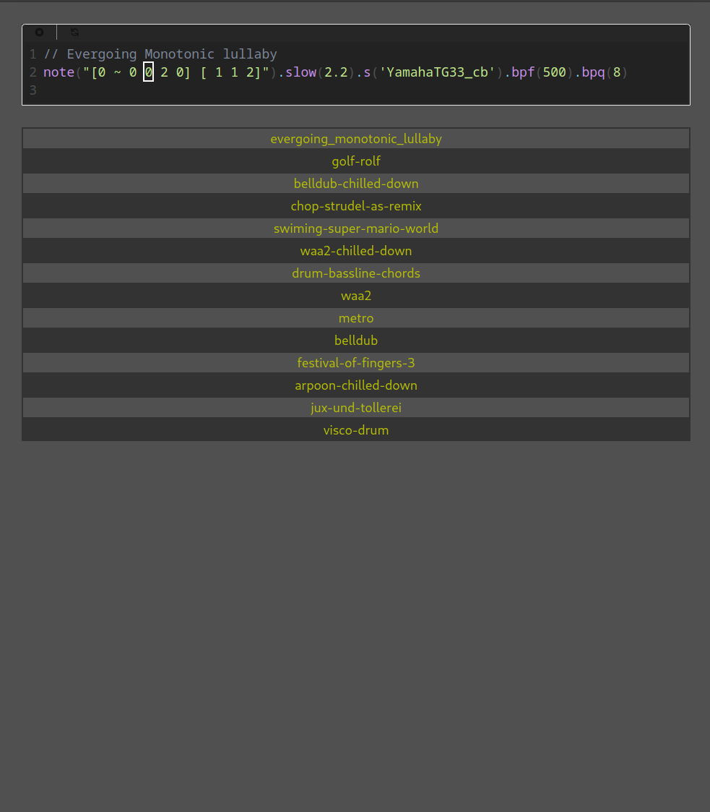

# SwirlBook

## What is this?

SwirlBook is a very simple proof of concept tool to manage your Strudel compositions.

## Why did you do this?

I have been playing around with this music generation system after using it in live coding events and have stored away some compositions that I liked, hacked away or made myself that I have found [here](https://github.com/jairomer/strudel).

In order to play these compositions I would have needed to look up for them, copy and paste them, which is kind of cumbersome.

During this time I was also learning about how to make user interfaces using react, so this was an opportunity to get some real experience and solve a small problem for myself.
I also got to review some concepts in JavaScript and front end development.  

## How did you do it?

I hacked the strudel minirepl away from the strudel codebase and encapsulated it within a react component, then used it to assemble this mini app.

I am no designer and can live well enough using basic interfaces, so I prefer not to spend too much time doing design decisions and focus on getting the functionality out of the door, which is the hardest part anyway.

This is also a purely front end app that relies on raw access to public repos in order to run, so the backend is minimal.
I made this decision out of laziness and also to focus on the react part instead of procrastinating with the features of another framework.

Instead, I am using a [github repo](https://github.com/jairomer/strudel) for storing the compositions. This repo contains a pre-commit git hook that generates a json file containing an index of all the songs that it contains.

### How to run it 

This is a simple Vite project that can be started with `pnpm run dev`.

## Conclusions 

I found it very challenging to reuse other React Components around the web, I had weird state and style errors with the data I wanted to insert in the components, it was easier for me to build my own components instead of reusing existing ones.

I was probably doing it wrong, but now I can understand why it is generally accepted the web ecosystem is a complete dumpster fire.

However, there are many companies that use these technologies, and the key seems to be to have a selection of well designed and interchangeable components that you can rely on to be used within your organization.

## Future work

Future work involves generalizing this miniapp made in roughly 20 total hours of work by someone with limited front-end experience so that other people can use it.

In order to do this, a BackEnd with a RESTful API and a proper database are probably needed because you can go only so far using github repos as your database.

However, I also believe this can be achieved in a simpler way using a monolithic architecture dynamically generating the webpages, in a similar way a Django app typically does.

There are many improvements I can think so far:
[ ] Add in a sample resolution server to decouple the minirepl from the availability of external sources.
[ ] Improve the song list navigation with a search bar.
[ ] Allow different users, right now it is single user.
[ ] Add unique URLs for the songs in order to make them easier to run and share.
[ ] Testing
